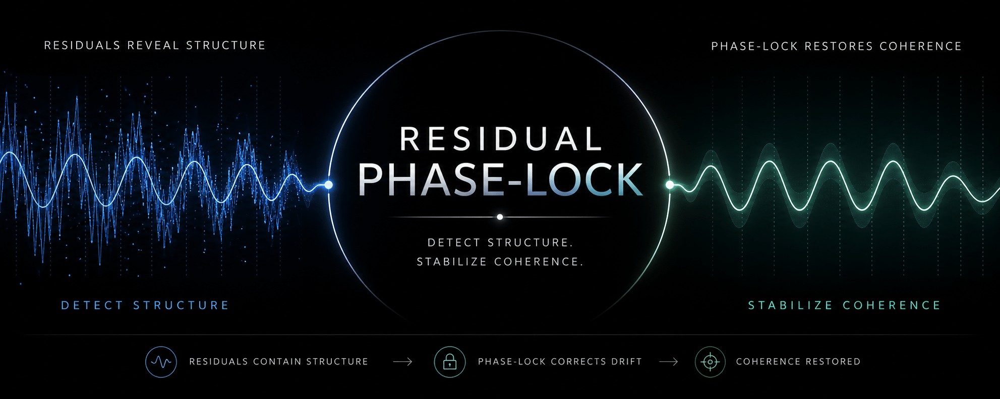
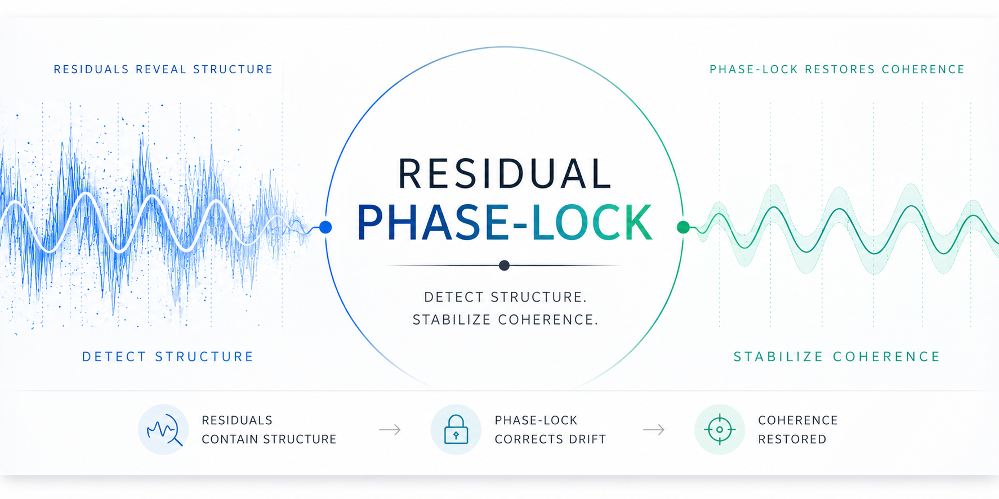

<p align="center">
  
</p>

# Residual Phase-Lock

**Detect structure via residuals.  
Stabilize coherence against drift.**

---

## Core Idea

Residual phase-lock provides a general mechanism:

- residuals encode missing structure  
- models drift from that structure  
- phase-lock correction restores coherence  
- residual structure can be learned (bounded)  
- correction strength provides continuous control  

---

## Interpretation

```
Residual ≠ noise  
Drift ≠ random error  
Phase-lock = structure-aware correction that restores coherence
```

---

## Key Results

- Residual correlation (04): **~0.95** → residual is structured  
- RMSE reduction (04): **~68%** → learned correction generalizes  
- Residual structure score (04): **0.80 → 0.18** → structured error removed  
- Drift → **0.000** with phase-lock (03, 06) → full coherence restoration  
- Partial phase-lock (07): smooth drift → coherence transition  

---

## Notebook Arc

| Notebook | Role |
|---|---|
| 01 | Residuals reveal structure |
| 02 | Topology drift appears |
| 03 | Phase-lock corrects known drift |
| 04 | Learned bounded residual correction generalizes |
| 05 | Sequence topology drift appears |
| 06 | Sequence phase-lock corrects drift |
| 07 | Phase-lock strength controls drift/coherence |

---

## Results Overview

Full results and metrics:

👉 [docs/results_overview.md](docs/results_overview.md)

---

## How It Works

```
model → residual → structure signal
           ↓
     phase-lock correction
           ↓
      reduced drift
           ↓
      restored coherence
```

---

## Repository Structure

```text
notebooks/   → experiments (01–07)
results/     → metrics (summary.json, csv)
figures/     → plots
docs/        → summaries + results overview + banner
src/         → export utilities
scripts/     → build_results_overview.py
```

---

## Quick Start

```bash
git clone https://github.com/thinkthoughts/residual-phase-lock.git
cd residual-phase-lock

python -m venv venv
source venv/bin/activate
pip install -r requirements.txt

python scripts/build_results_overview.py
```

---

## Reproducibility

Each notebook exports:

```
figures/
results/
docs/
```

Summaries are automatically aggregated:

```bash
python scripts/build_results_overview.py
```

---

## Claim

Residual phase-lock is a **general, domain-independent mechanism**:

```
detect structure → correct drift → restore coherence
```

---

## Status

- [x] Residual structure detection  
- [x] Drift demonstration  
- [x] Known constraint correction  
- [x] Learned residual correction (bounded)  
- [x] Sequence generalization  
- [x] Continuous control (partial phase-lock)  

---

## License

MIT

<p align="center">
  
</p>
