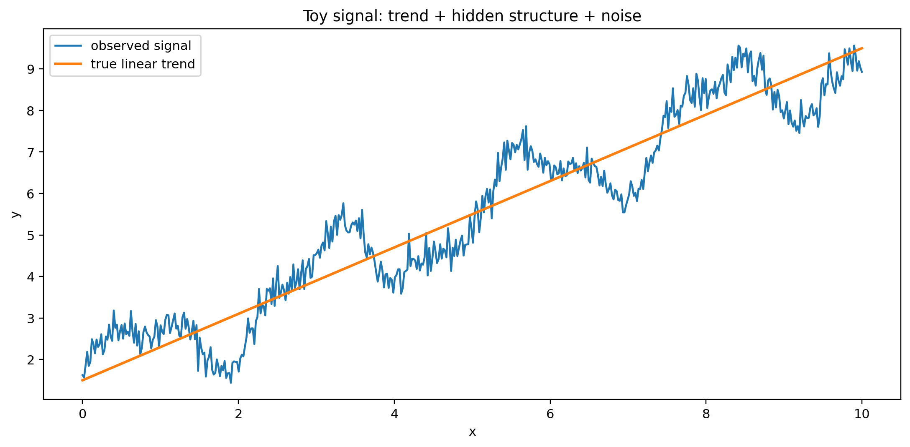
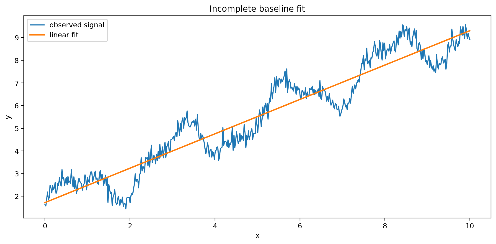
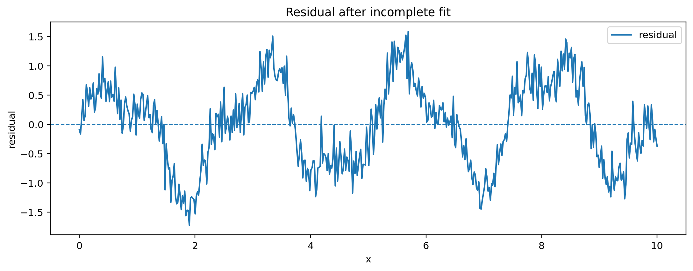
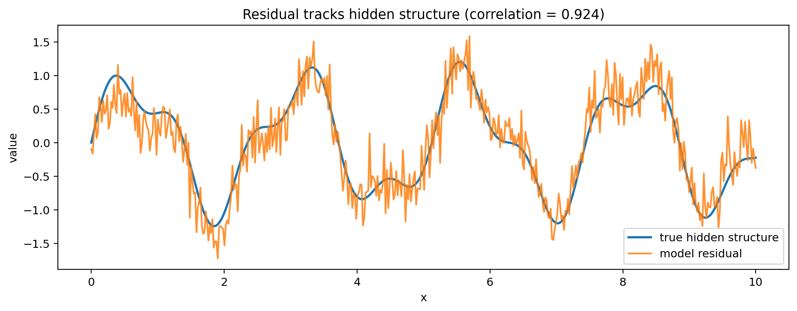
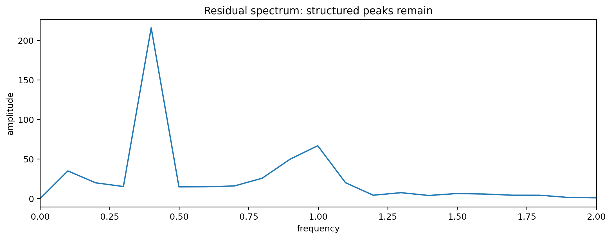

# Notebook 01 — Residuals Are Not Noise

## Results

| Metric | Value |
|--------|------:|
| Baseline R² | 0.903 |
| Baseline RMSE | 0.717 |
| Residual correlation | 0.924 |
| Residual structure score | 0.832 |

## Figures












## Interpretation

```text
good fit ≠ structure exhausted
residual ≠ noise
residual → structure signal
```

