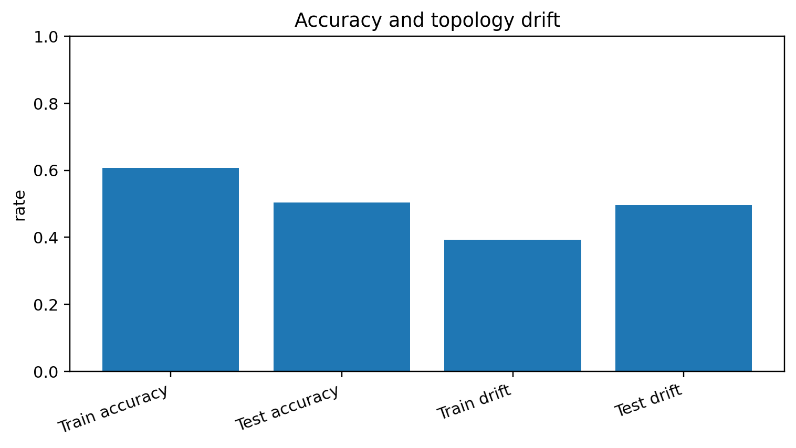
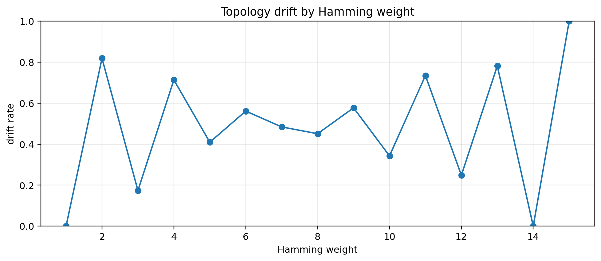
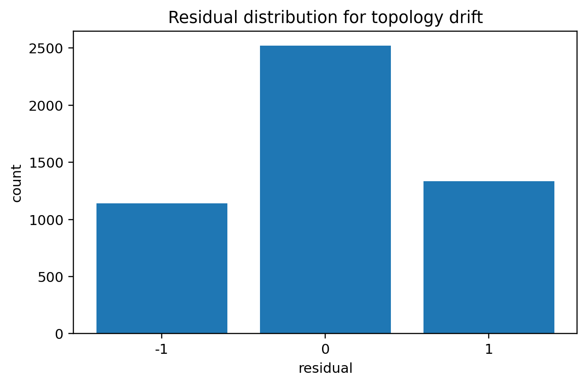
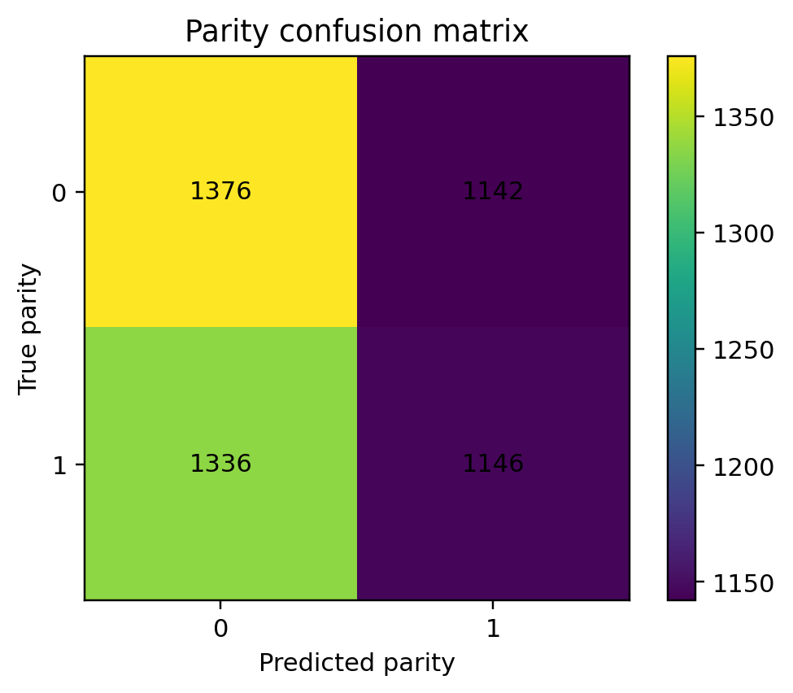

# Notebook 02 — Topology Drift Demo

## Results

| Metric | Value |
|--------|------:|
| Train accuracy | 0.608 |
| Test accuracy | 0.504 |
| Train drift rate | 0.392 |
| Test drift rate | 0.496 |
| Generalization gap | 0.104 |

## Figures










## Interpretation

```text
accuracy ≠ coherence
local fit → topology drift
residuals expose structural violation
```

