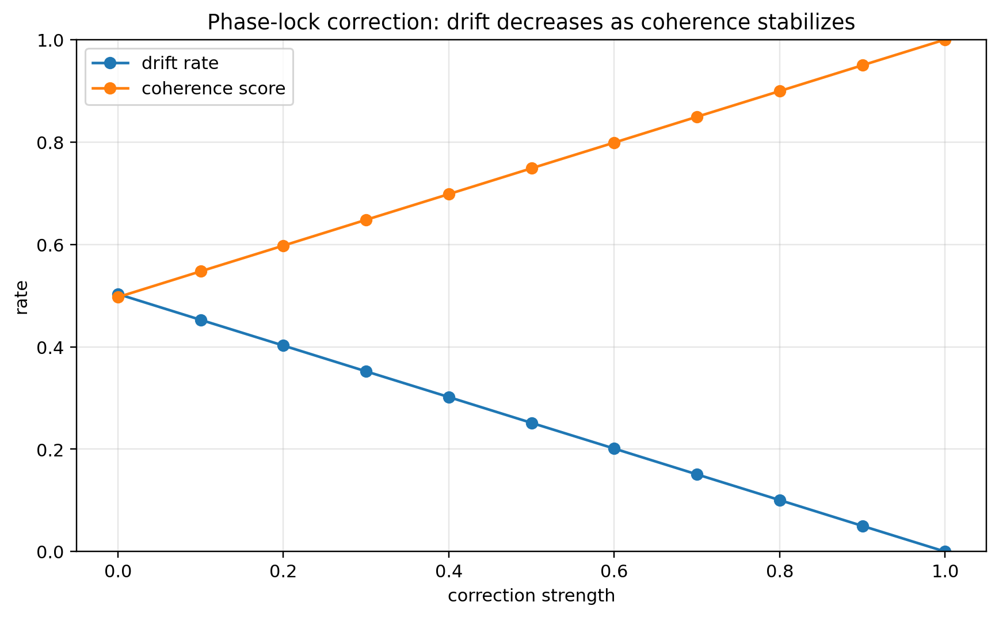
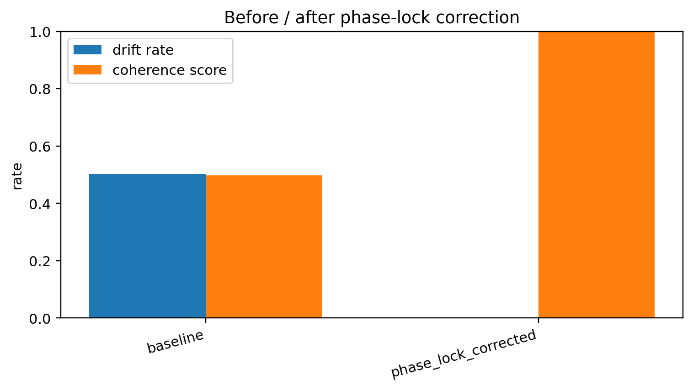
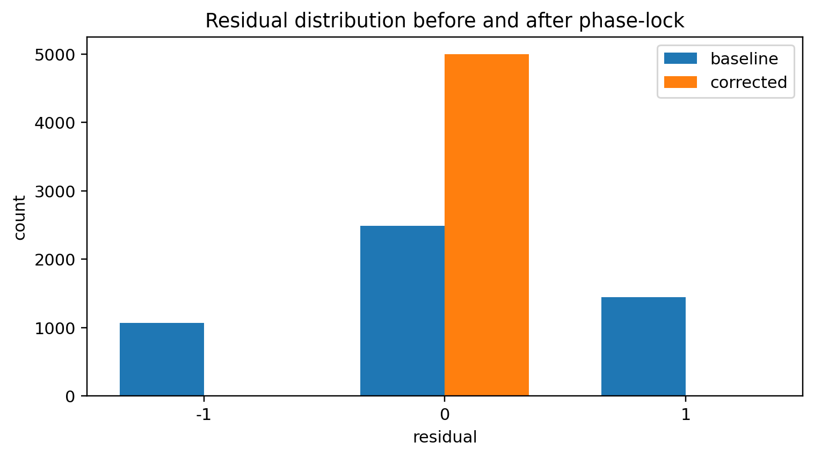
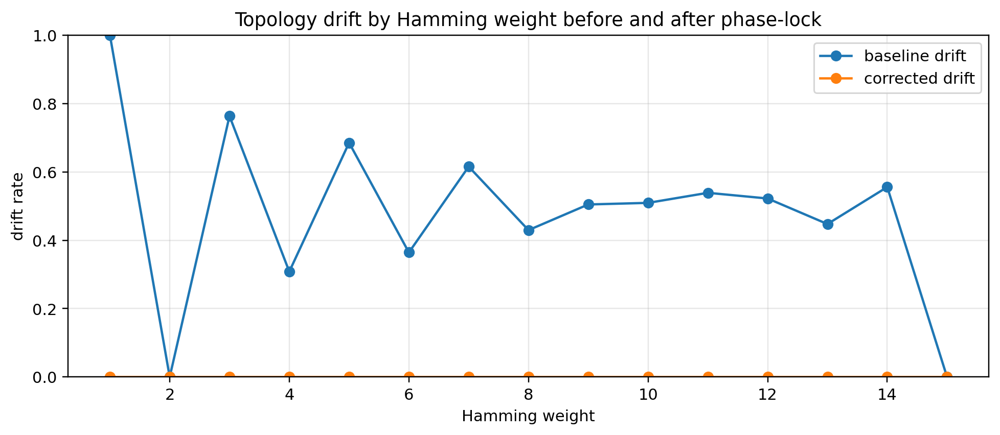

# Notebook 03 — Phase-Lock Correction Loop

## Results

| Metric | Value |
|--------|------:|
| Baseline accuracy | 0.497 |
| Baseline drift rate | 0.503 |
| Corrected accuracy | 1.000 |
| Corrected drift rate | 0.000 |
| Relative drift reduction | 1.000 |
| Corrected coherence score | 1.000 |

## Figures










## Interpretation

```text
residual → drift signal
phase-lock → correction loop
coherence stabilizes against drift
```

