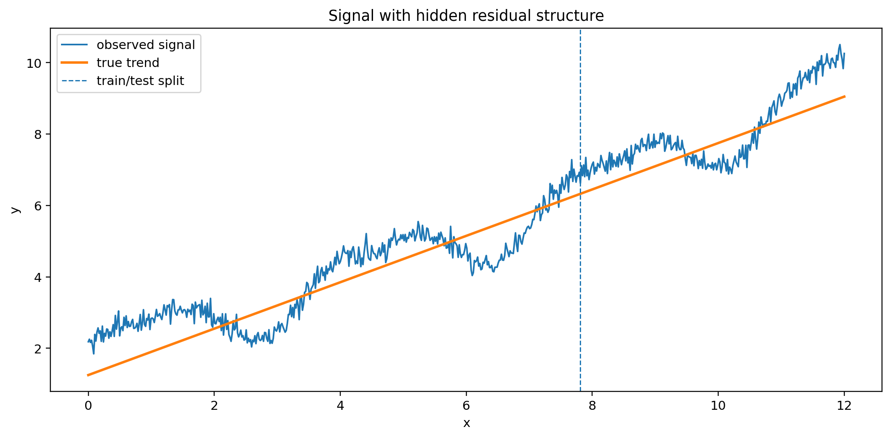
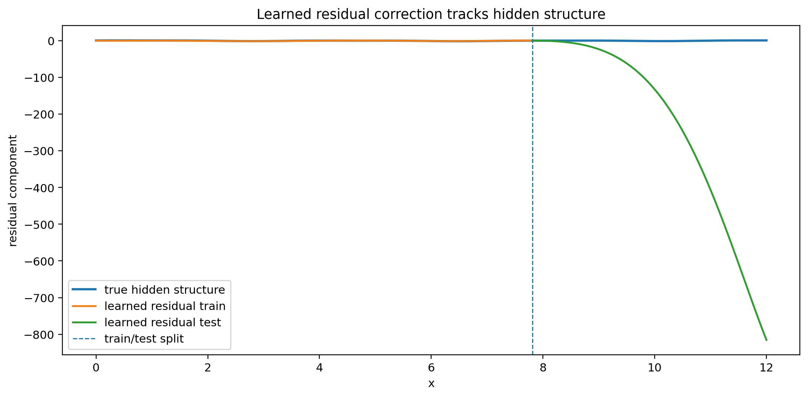
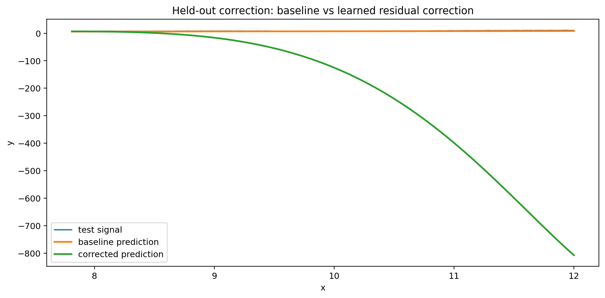
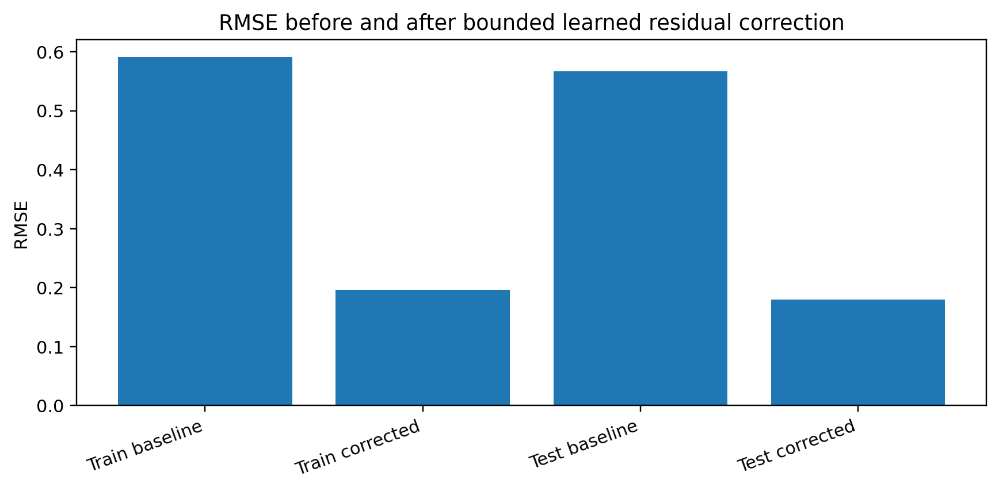
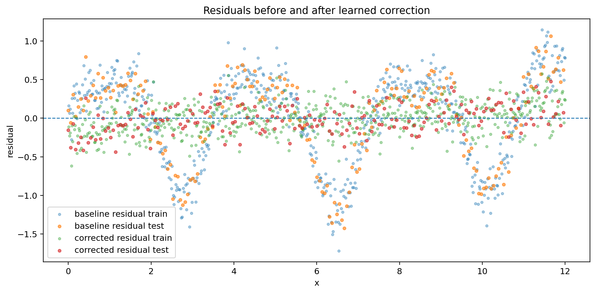
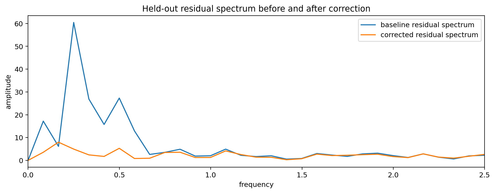
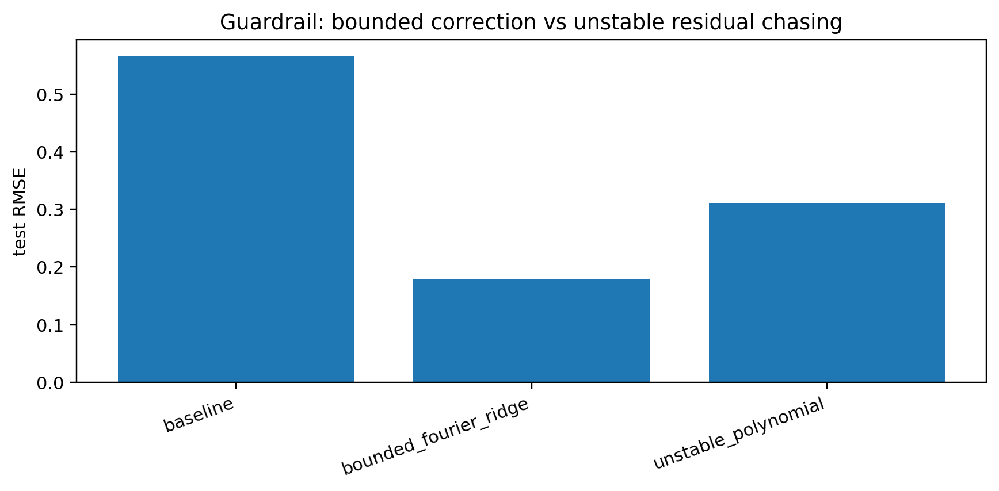

# Notebook 04 — Learned Residual Correction

## Results

| Metric | Value |
|--------|------:|
| Baseline test RMSE | 0.567 |
| Corrected test RMSE | 0.180 |
| Relative test RMSE reduction | 0.683 |
| Residual correlation test | 0.949 |
| Baseline residual structure score | 0.798 |
| Corrected residual structure score | 0.180 |
| Unstable polynomial test RMSE | 0.311 |

## Figures
















## Interpretation

```text
residual → learn missing structure
bounded residual learner → correction
coherence stabilizes as structured residual is removed
unbounded residual chasing can destabilize correction
```

