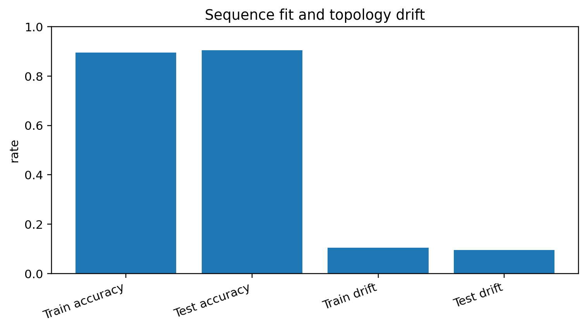
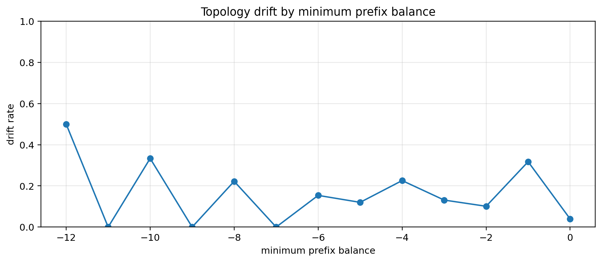
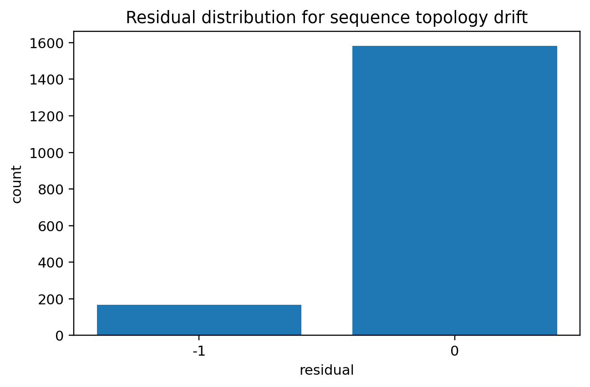
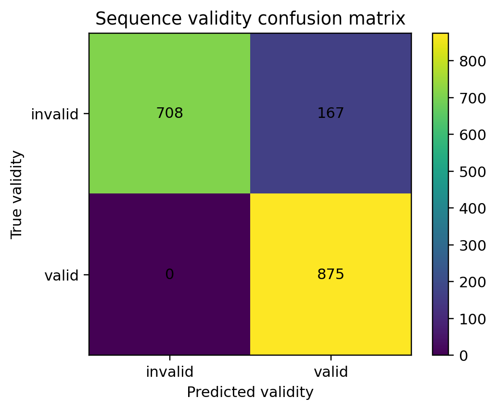

# Notebook 05 — Sequence Topology Drift

## Results

| Metric | Value |
|--------|------:|
| Train accuracy | 0.895 |
| Test accuracy | 0.905 |
| Train drift rate | 0.105 |
| Test drift rate | 0.095 |
| Generalization gap | -0.010 |

## Figures










## Interpretation

```text
sequence fit ≠ structure preservation
local token features can drift from global nesting
residuals expose sequence topology drift
```

