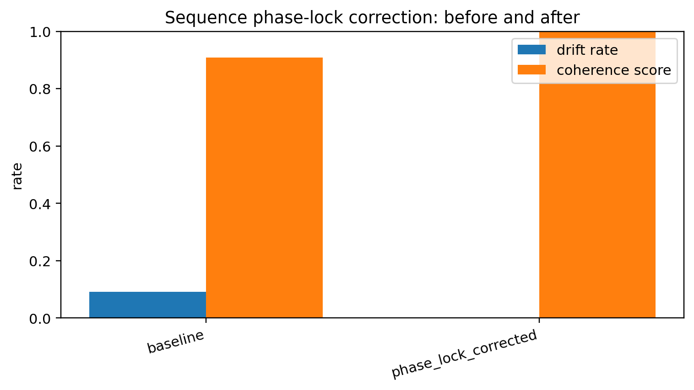
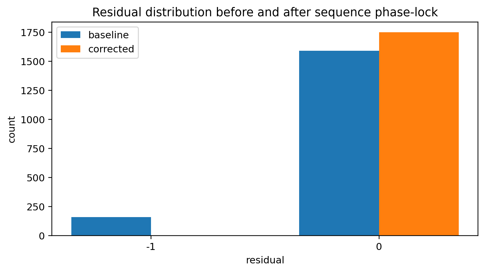
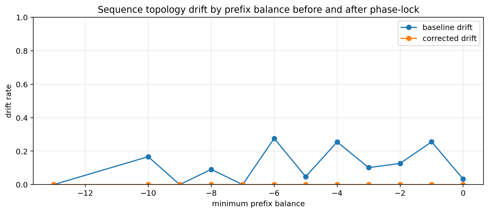
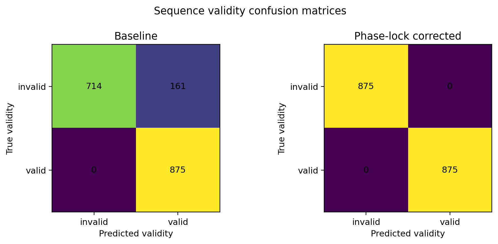

# Notebook 06 — Sequence Phase-Lock Correction

## Results

| Metric | Value |
|--------|------:|
| Baseline test accuracy | 0.908 |
| Baseline test drift rate | 0.092 |
| Corrected test accuracy | 1.000 |
| Corrected test drift rate | 0.000 |
| Relative drift reduction | 1.000 |
| Corrected coherence score | 1.000 |

## Figures










## Interpretation

```text
sequence topology drift is detectable
phase-lock correction checks global structure
coherence stabilizes against drift
```

