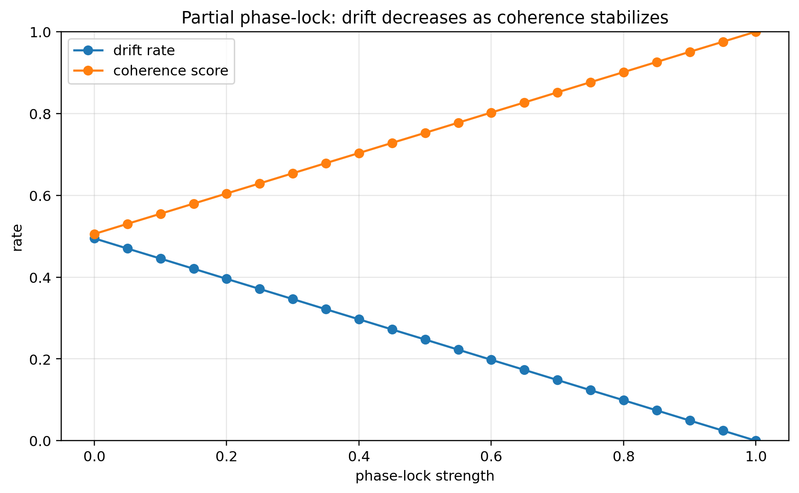
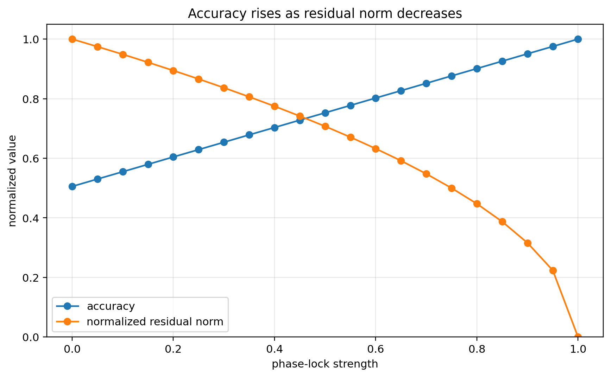
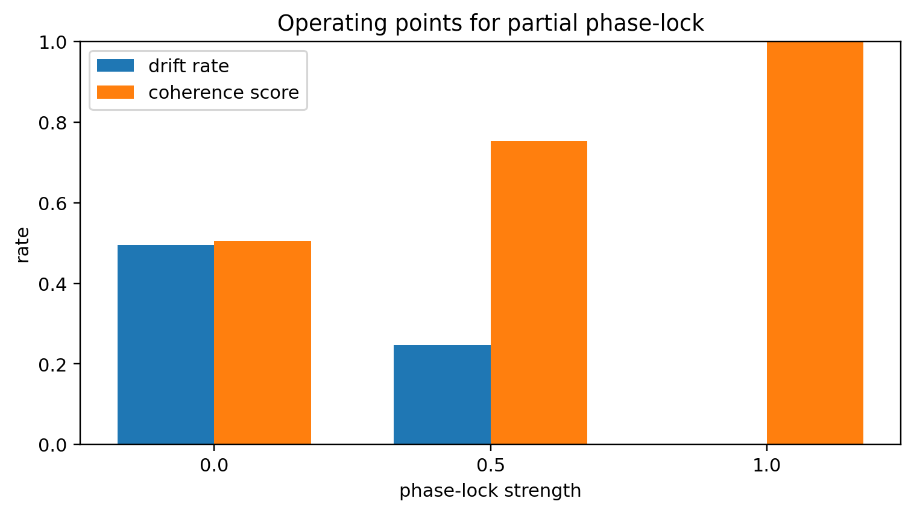
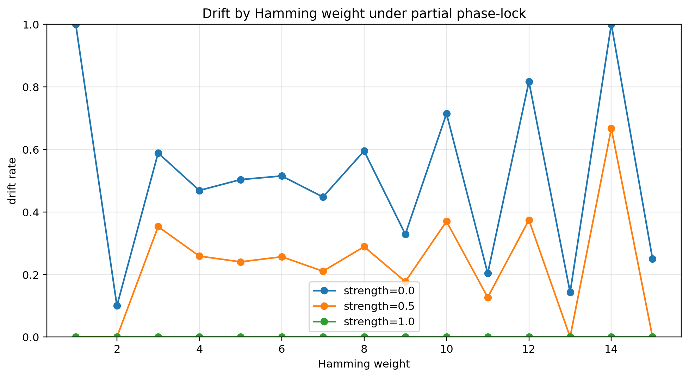
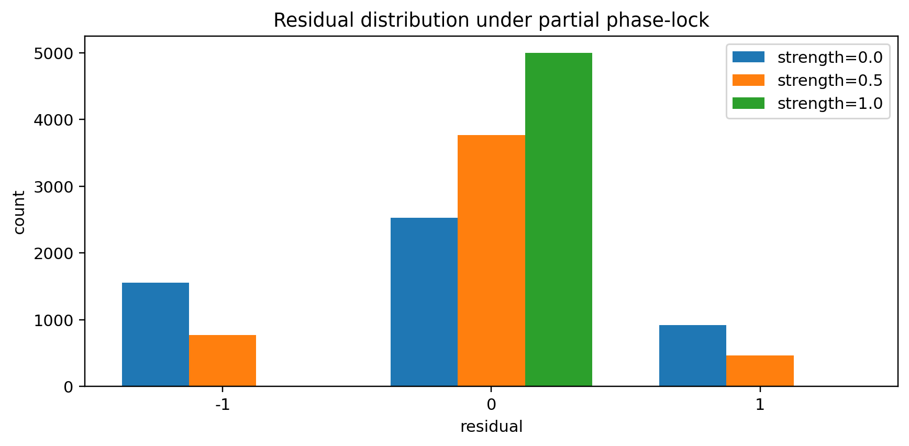

# Notebook 07 — Partial Phase-Lock

## Results

| Metric | Value |
|--------|------:|
| Baseline accuracy | 0.505 |
| Baseline drift rate | 0.495 |
| Baseline coherence score | 0.505 |
| Mid-strength drift rate | 0.247 |
| Mid-strength coherence score | 0.753 |
| Full-strength drift rate | 0.000 |
| Full-strength coherence score | 1.000 |

## Figures












## Interpretation

```text
phase-lock is a continuous control mechanism
strength controls drift reduction
coherence stabilizes as residual drift decreases
```

