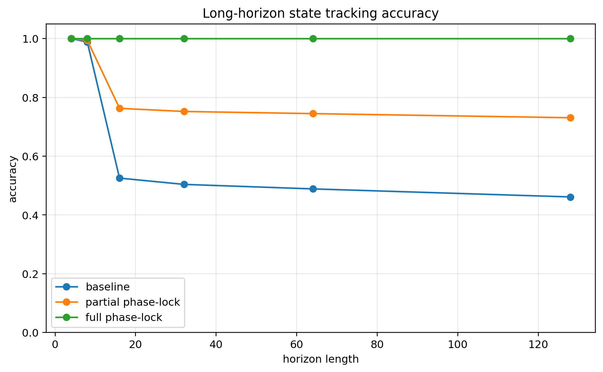
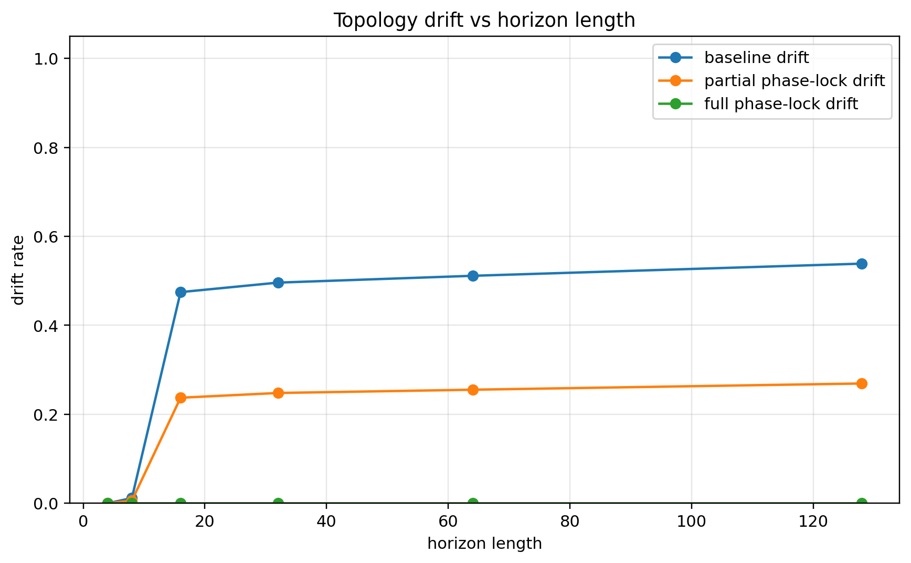
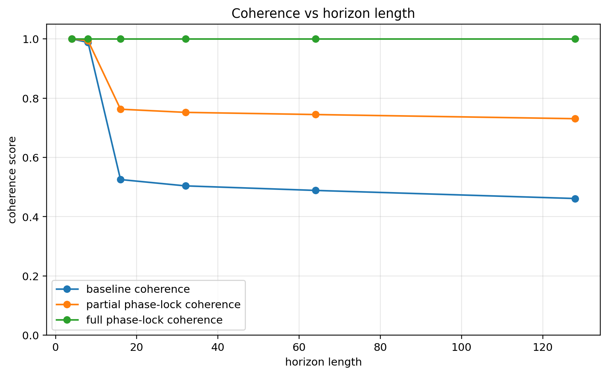
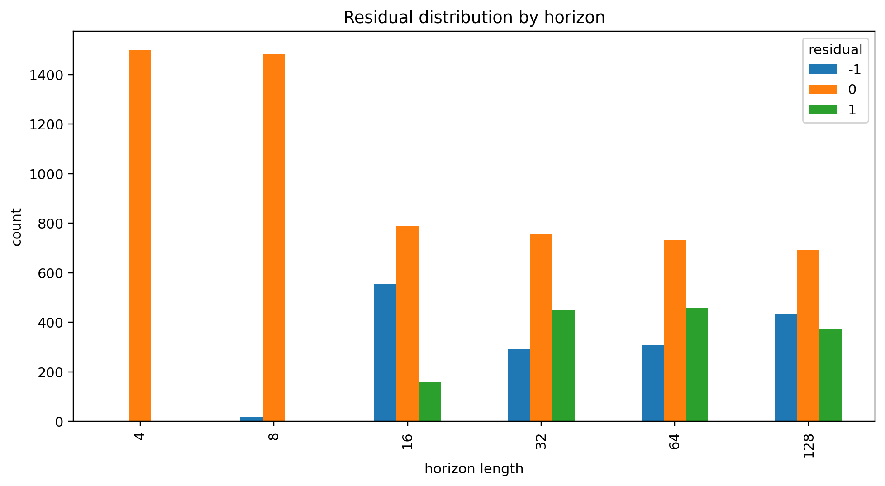

# Notebook 08 — Long-Horizon State Tracking

## Results

| Metric | Value |
|--------|------:|
| First horizon | 4.000 |
| Last horizon | 128.000 |
| Baseline accuracy first | 1.000 |
| Baseline accuracy last | 0.461 |
| Baseline drift last | 0.539 |
| Partial drift last | 0.269 |
| Corrected drift last | 0.000 |
| Corrected coherence last | 1.000 |

## Figures










## Interpretation

```text
dynamic state tracking exposes horizon-dependent drift
residuals encode untracked state
phase-lock suppresses drift and stabilizes coherence
```

